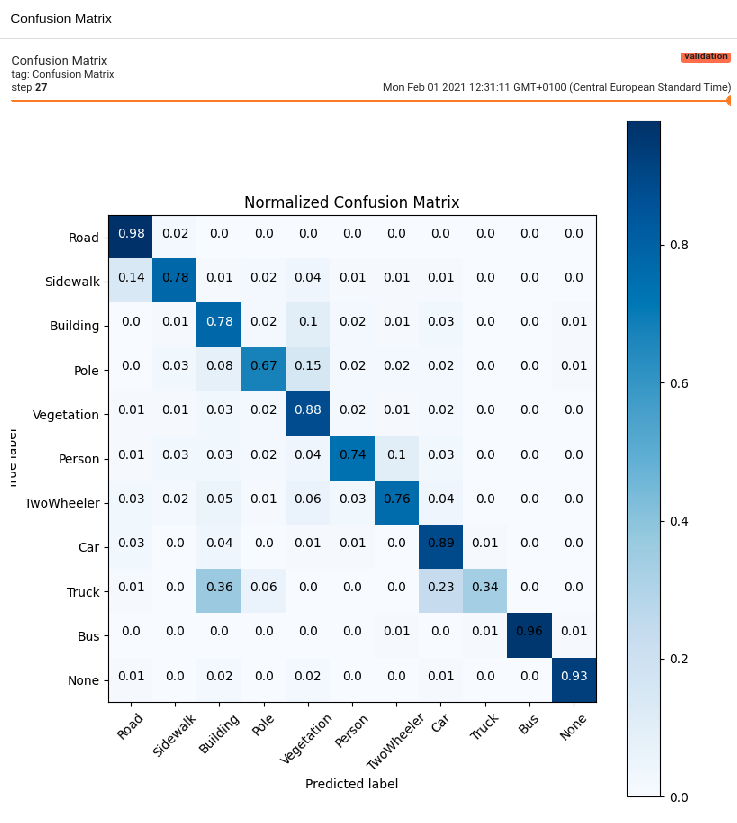
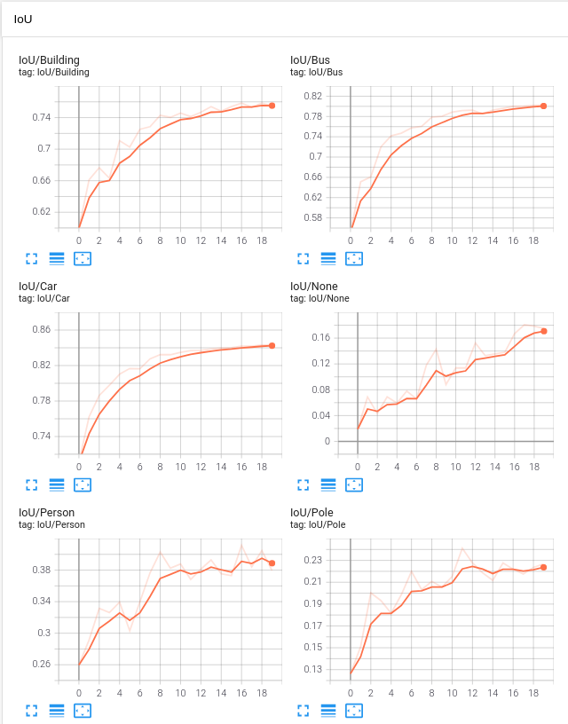
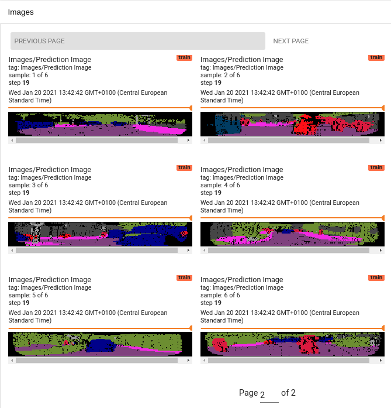

## Semantic Segmentation of LiDAR Point Clouds in Tensorflow 2.4
[](https://zenodo.org/badge/latestdoi/346761395)


This repository contains implementations of SqueezeSegV2 [1], Darknet52 [2] and Darknet21 [2] for semantic point cloud
segmentation implemented in Keras/Tensorflow 2.4. The repository contains the model architectures, training, evaluation and
visualisation scripts.

## Usage


#### Installation
All required libraries are listed in the `requirements.txt` file. You may install them within a [virtual environment](https://packaging.python.org/guides/installing-using-pip-and-virtual-environments/#creating-a-virtual-environment) with:
```bash
pip install -r requirements.txt
```

For visualizations using matplotlib, you will need to install `tkinter`:

`sudo apt-get install python3-tk`

#### Data Format
This repository relies on the data format as in [1]. A dataset has the following file structure:
```
.
├── ImageSet
    ├── train.txt
    ├── val.txt
    ├── test.txt
├── train
├── val
├── test
```
The data samples are located in the directories `train`, `val` and `test`. The `*.txt` files within the directory
`ImageSet` contain the filenames for the corresponding samples in data directories.
 
 A data sample is stored as a numpy `*.npy` file. Each file contains
a tensor of size `height X width X 6`. The 6 channels correspond to

0. X-Coordinate in [m]
1. Y-Coordinate in [m]
2. Z-Coordinate in [m]
3. Intensity (with range [0-255])
4. Depth in [m]
5. Label ID

For points in the point cloud that are not present (e.g. due to no reflection), the depth will be zero.
A sample dataset can be found in the directory `data`.

#### Sample Dataset
This repository provides a sample dataset which can be used as a template for your own dataset. The directory 
`sample_dataset` a small `train` and `val` split with 32 samples and 3 samples, respectively. The samples in the train
dataset are automatically annoated by cross-modal label transfer while the validation set was manually annotated.


#### Data Normalization
For a proper data normalization it is necessary to iterate over training set and determine the __mean__ and __std__
values for each of the input fields. The script `preprocessing/inspect_training_data.py` provides such a computation.

```bash
# pclsegmentation/pcl_segmentation
$ python3 preprocessing/inspect_training_data.py \
--input_dir="../sample_dataset/train/" \
--output_dir="../sample_dataset/ImageSet"
```
The glob pattern `*.npy` is applied to the `input_dir` path. The script computes and prints the mean and std values
for the five input fields. These values should be set in the configuration files in [pcl_segmentation/configs](pcl_segmentation/configs) as the arrays `mc.INPUT_MEAN` and
 `mc.INPUT_STD`.

#### Training
The training of the segmentation networks can be evoked by using the `train.py` script. It is possible to choose between
three different network architectures: `squeezesegv2` [1],  `darknet21` [2] and `darknet52` [2].
The training script uses the dataset splits `train` and `val`. The metrics for both splits are constantly computed
during training. The Tensorboard callback also uses the `val` split for visualisation of the current model prediction.
```bash
# pclsegmentation/pcl_segmentation
$ python3 train.py \
--data_path="../sample_dataset" \
--train_dir="../output" \
--epochs=5 \
--model=squeezesegv2
```

#### Evaluation
For the evaluation the script `eval.py` can be used.
Note that for the evaluation the flag `--image_set` can be set to `val` or `test` according to datasets which are present
at the `data_path`.
```bash
# pclsegmentation/pcl_segmentation
$ python3 eval.py \
--data_path="../sample_dataset" \
--image_set="val" \
--eval_dir="../eval" \
--path_to_model="../output/model" \
--model=squeezesegv2
```

#### Inference
Inference of the model can be performed by loading some data samples and by loading the trained model. The script 
includes visualisation methods for the segmented images. The results can be stored by providing 
`--output_dir` to the script.
```bash
# pclsegmentation/pcl_segmentation
$ python3 inference.py \
--input_path="../sample_dataset/train/*.npy" \
--output_dir="../output/prediction" \
--path_to_model="../output/model" \
--model=squeezesegv2
```

## Tensorboard
The implemention also contains a Tensorboard callback which visualizes the most important metrics such as the __confusion
matrix__, __IoUs__, __MIoU__, __Recalls__, __Precisions__, __Learning Rates__, different __losses__ and the current model
__prediction__ on a data sample. The callbacks are evoked by Keras' `model.fit()` function.

```bash
# pclsegmentation
$ tensorboard --logdir ../output
```






## More Inference Examples

Left image: Prediction - Right Image: Ground Truth


## References
The network architectures are based on 
- [1] [SqueezeSegV2: Improved Model Structure and Unsupervised Domain Adaptation for Road-Object Segmentation from a 
LiDAR Point Cloud](https://github.com/xuanyuzhou98/SqueezeSegV2)
- [2] [RangeNet++: Fast and Accurate LiDAR Semantic Segmentation](https://github.com/PRBonn/lidar-bonnetal)


### TODO
- [ ] Write `.tfevents` for the evaluation method
- [ ] Integrate data normalization into the Dataloader class
- [ ] Implement CRF Postprocessing for SqueezeSegV2
- [ ] Implement a Dataloader for the Semantic Kitti dataset

### Author of this Repository
[Till Beemelmanns](https://github.com/TillBeemelmanns)

Mail: `till.beemelmanns (at) ika.rwth-aachen.de`
